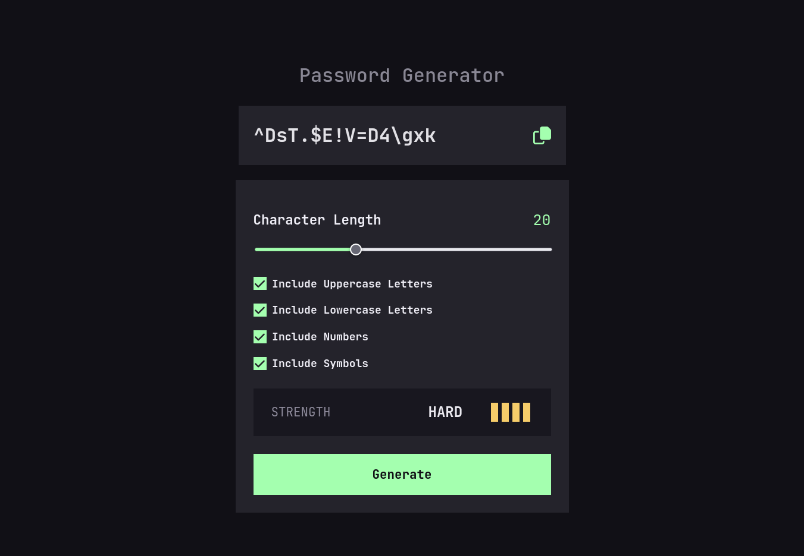
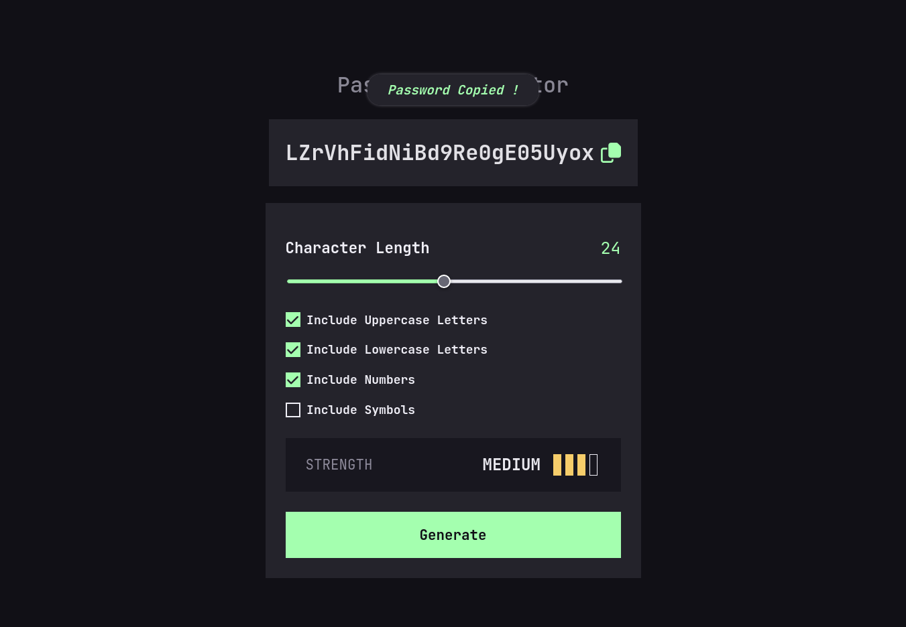
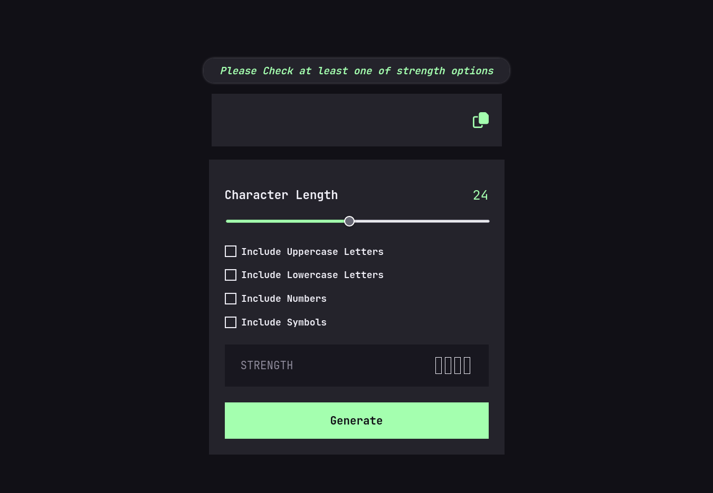

# Password-generator

Password generator with typescript,javascript users can choose many options to their passwords

## Table of contents

- [Overview](#overview)
  - [The challenge](#the-challenge)
  - [Screenshot](#screenshot)
  - [Links](#links)
- [My process](#my-process)
  - [Built with](#built-with)
- [Author](#author)

## Overview

### The challenge

Users should be able to:

- Generate a password based on the selected inclusion options
- Copy the generated password to the computer's clipboard :
  - Show copied password message
- See a strength rating for their generated password
- View the optimal layout for the interface depending on their device's screen size
- See hover and focus states for all interactive elements on the page
- Receive an error message when user click on generator button if:
  - The user don't checked at least one of strength options

### Screenshot

### Links

- Live Site URL: [live site URL here](https://jalal-aljhny.github.io/Password-generator/)

## My process

### Built with

- Semantic HTML5 markup
- CSS custom properties
- Flexbox
- sass
- javascript
- typescript

## Author

- GitHub - [Jalal Aljhny](https://github.com/Jalal-Aljhny)
- Frontend Mentor - [@Jalal Aljhny](https://www.frontendmentor.io/profile/Jalal-Aljhny)
